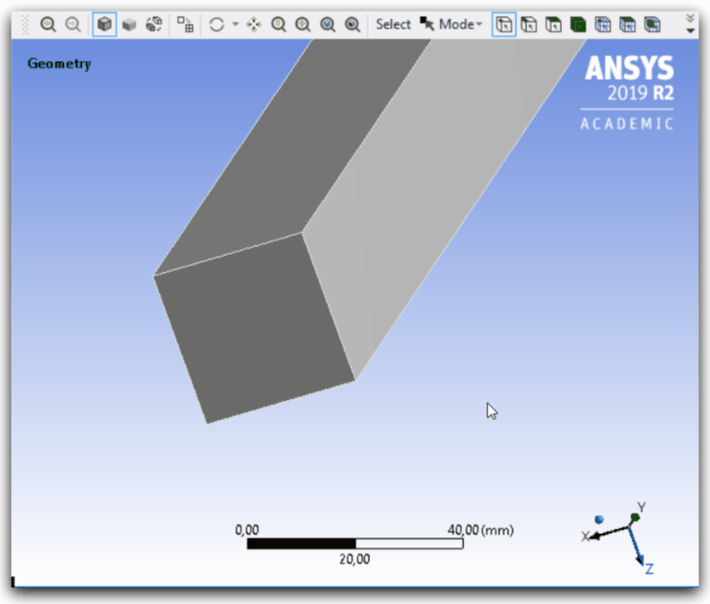
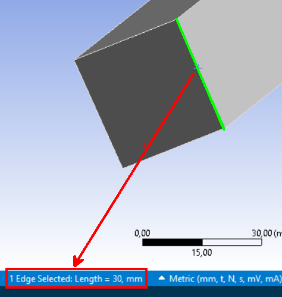
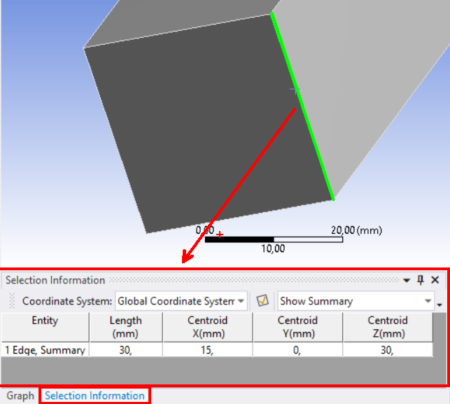

# Selektieren von Geometrien

- ℹ️ (Mechanical) **Geometrieauswahl:** z.B. für Randbedingungen

  **Geometrieauswahl**

  

  

  Durch die Symbolleiste können **Punkte**, **Linien**, **Flächen** und **Körper** ausgewählt werden

  **Mehrfachselektion**

  

  

  **Variante** 1: **Single Select Modus**:
  Taste `STR` gedrückt halten während der Auswahl

  

  **Variante 2**: **Box Select Modus:**
  `Ziehen` einer `Box mit der Maus`

    <aside>
    ⚠️ Stellen Sie danach wieder auf Single Select Modus um!
    </aside>

- ℹ️ (Mechanical) **Geometrie**-**Selektionsinformationen:** Koordinaten, Längen, ..
    <aside>
    💡 Dies sollten verwenden wenn Sie prüfen wollen, ob Sie die Geometrie richtig in das Modell übertragen haben oder ob Sie die richtige Geometrie für die Randbedingungen ausgewählt haben.
    </aside>
    
    
    
    Ausgewählte Geometrien werden in der unteren blauen Leiste mit nützlichen Informationen (abhängig von Anzahl und Art der Geometrie)
    
    
    å
    Noch genauere Informationen erhält man im Fenster **Selection Information,** welches mit der **Taste `i`** aufgerufen werden kann
