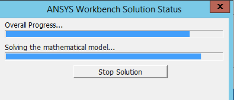

# Lösung Gleichungssystem

Zu Beginn sind erst einmal keine Lösungseinstellungen notwendig. Das Modell kann gelöst werden.

 <iframe src="http://ior.ad/6XAq" width="100%" height="500px" style="width: 100%; height: 500px; border-bottom: 1px solid #ccc;" referrerpolicy="strict-origin-when-cross-origin" frameborder="0" webkitallowfullscreen="webkitallowfullscreen" mozallowfullscreen="mozallowfullscreen" allowfullscreen="allowfullscreen" allow="camera; microphone; clipboard-write"></iframe>

In Abhängigkeit von der Modellgröße und Elementanzahl wird der Vorgang der Modelllösung mehr Zeit in Anspruch nehmen.
