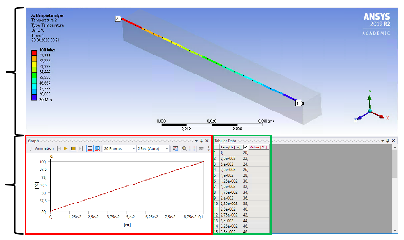
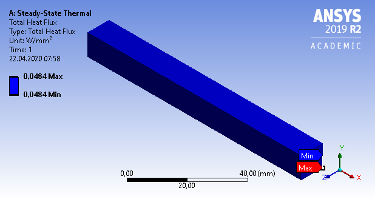
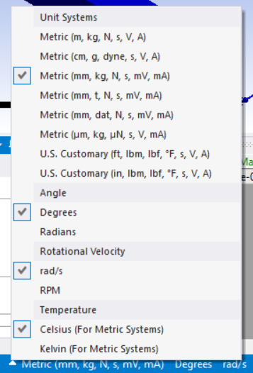

# Lösungsdarstellung

Nachdem das Modell gelöst wurde, können die Ergebnisse ausgewertet werden. Die **Auswertung** muss zur Lösung der Aufgabenstellung beitragen und die an das Modell gestellten Fragen beantworten. Dafür müssen Sie entscheiden **wie** (Min/Max Werte, Konturdarstellung, tabellarisch...) und **wo** (Modellkante,-fläche, Punkt, Element...) **welche Ergebnisparameter** (Temperatur, Wärmestrom...) relevant sind. In diesem Beispiel werden Sie die Auswertung der Ergebnisse nach Vorgaben vornehmen. In einem späteren Seminar werden Sie dann den Umgang durch das Üben verschiedener Möglichkeiten näher kennenlernen.

 <iframe src="http://ior.ad/6XCx" width="100%" height="500px" style="width: 100%; height: 500px; border-bottom: 1px solid #ccc;" referrerpolicy="strict-origin-when-cross-origin" frameborder="0" webkitallowfullscreen="webkitallowfullscreen" mozallowfullscreen="mozallowfullscreen" allowfullscreen="allowfullscreen" allow="camera; microphone; clipboard-write"></iframe>

Graphikfenster mit Legende

Ergebnisdarstellung graphisch und tabellarisch

**Hinweis zu den Einheiten:**

Wenn ihr Ergebnis in den falschen Einheiten erscheint (siehe Bild), können Sie diese unten in der Leiste ändern.

Zum exportieren der Ergebnisse folgen Sie der Anweisung:

 <iframe src="http://ior.ad/6XFj" width="100%" height="500px" style="width: 100%; height: 500px; border-bottom: 1px solid #ccc;" referrerpolicy="strict-origin-when-cross-origin" frameborder="0" webkitallowfullscreen="webkitallowfullscreen" mozallowfullscreen="mozallowfullscreen" allowfullscreen="allowfullscreen" allow="camera; microphone; clipboard-write"></iframe>

Stellen Sie die beiden exportierten Ergebnissdateien mit einem Programm Ihrer Wahl graphisch dar.
