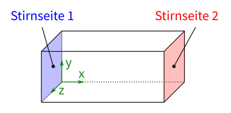

# Vorzeigebeispiel Fall b)

Nachfolgend soll nun in unserem Beispiel eine andere Randbedingung verwendet werden

## Gegeben:

**Randbedingungen**

**Stirnseite 1**:

$$
T_1=20\mathrm{°C}
$$

**Stirnseite 2**:

Fall b) **konstante Wärmezufuhr** auf Stirnseite 2

$$
\dot{q}_{H}=3 \mathrm{\frac{kW}{m^2}}
$$

## Gesucht:

Bestimmten Sie den **Temperaturverlauf und die Wärmestromdichte von der Stirnseite 1 bis zur Stirnseite 2** für nun für den Fall b. Prüfen Sie die Ergebnisse auf Plausibilität z.B. durch den Abgleich mit analytischen Gleichungen.

⏹️ Im Workbench Projektmenü: Ziehen Sie eine neue "Steady-State Thermal" Analyse auf das Modell der vorherigen Analyse. Dadurch werden alle zuvor verwendenten Teile (Material, Geometrie und Vernetzung) übernommen und nur die Randbedingung und Lösung werden betrachtet.
