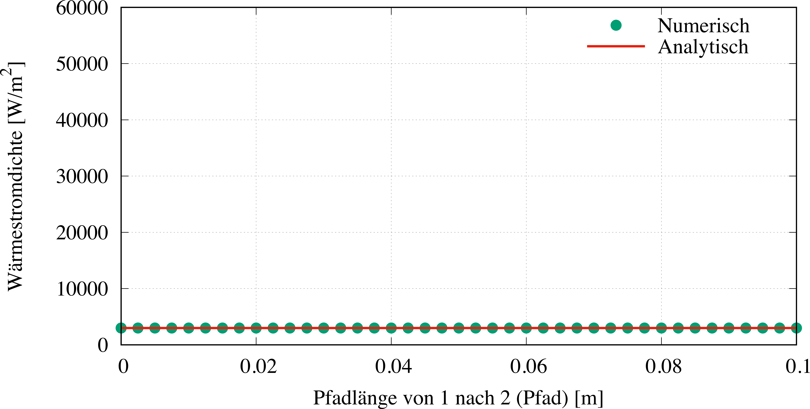
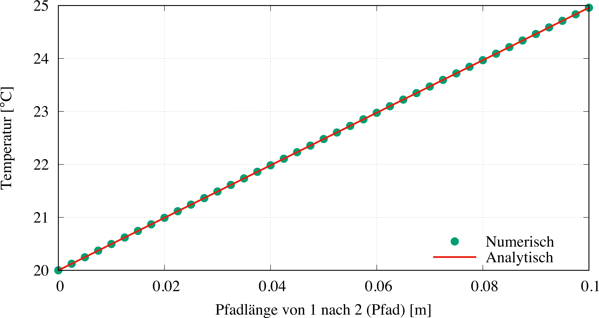

# Ergebnisse & Diskussion

Der Wärmestrom ist laut der obigen Gleichung im stationären Fall immer konstant. Zuerst muss die Größe des Wärmestroms oder der Wärmestromdichte ermittelt werden. Dann kann mit Hilfe der Geradengleichung die Temperatur an jedem Punkt ermittelt werden.

Bei einer konstanten Wärmezufuhr als Randbedingung der einen Stirnfläche und einer konstanten Temperatur auf der anderen Stirnseite gilt für den Wärmestrom durch den Körper in x-Richtung:

$$
\dot q_{\lambda}=\dot q_H
$$

$$
\dot q_{\lambda}=3.000{,}0\,\mathrm{\frac{W}{m^2}}
$$

