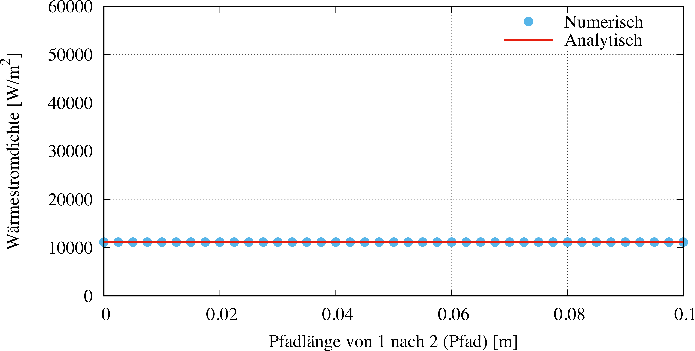
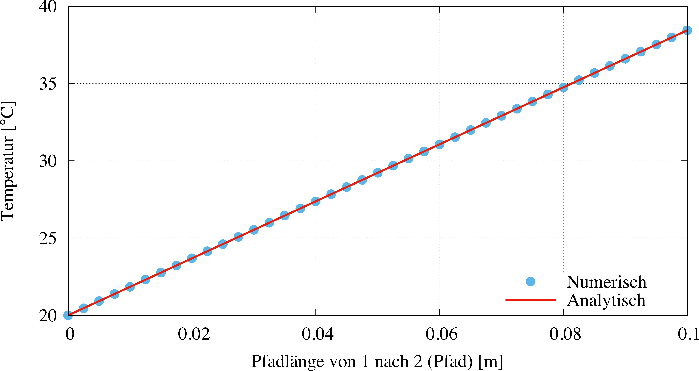

# Ergebnisse & Diskussion

Bei konstanten Bedingungen einer Konvektion an der Stirnfläche 2 und der konstanten Temperatur auf der Stirnseite gilt:

$$
\dot q_{\lambda}=\dot q_\alpha
$$

Mit Hilfe der Gleichung für die Wärmeübertragung bei einer Konvektion

$$
\dot q_\alpha=\alpha\,(T_{\mathrm{amb}}-T_{\mathrm{2}})
$$

und dem Gesetz der Wärmeleitung

$$
T_{\mathrm{2}}=\frac{{\Delta L}_{12}}{\lambda}\,\dot q_{\lambda}+T_{\mathrm{1}}
$$

kann die Wärmestromdichte durch den Körper in x-Richtung für diese Modell berechnet werden.

